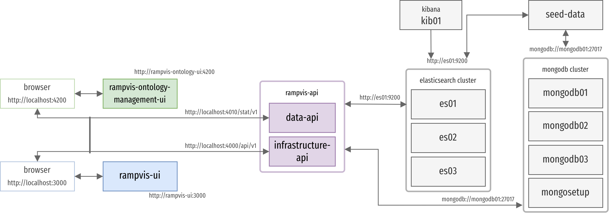

# About

This project implements RESTful APIs for the RAMPVIS system. This repository consist of the following top-level folders.

1. data-api

   - Implemented in Python, FastAPI, and other Python libraries.
   - APIs for all data.
   - API implements processing functions, e.g., analytical algorithms, propagation, scheduler agents, etc.

2. infrastructure-api
   - Implemented in Typescript, Node.js, Express.js, and other JavaScript libraries.
   - APIs for ontology and database operations; authentication and user management; other infrastructure related services.
   - Thumbnail and search index services.

## Getting Started

### Prerequisites

- This is tested in Ubuntu 22.04 and WSL.
- Ensure docker is running. 
- We created multiple docker-compose scripts and each script handles a set of services. Sequentially start the services. Note that based on what version is installed either use `docker compose` or `docker-compose`.

- Update docker virtual memory size. Sometimes, the Elasticsearch services in docker crash due to a known issue: ` max virtual memory areas vm.max_map_count [65530] is too low, increase to at least [262144]`. Follow the instructions below to resolve this issue,

In WSL, run the following commnads in PowerShell. More information can be found [here](https://github.com/docker/for-win/issues/5202).

```bash
wsl -d docker-desktop cat /proc/sys/vm/max_map_count # current value
# 65530
wsl -d docker-desktop sysctl -w vm.max_map_count=262144
# vm.max_map_count = 262144
```

In Ubuntu, run the following command. More information can be found [here](https://www.elastic.co/guide/en/elasticsearch/reference/current/vm-max-map-count.html).

```sh
sudo sysctl -w vm.max_map_count=262144
```

### Stop & Clean (optional)

Stop & clean [rampvis-ui](https://github.com/ScottishCovidResponse/rampvis-ui#stop--clean-optional) and [rampvis-ontology-management-ui](https://github.com/saifulkhan/rampvis-ontology-management-ui#stop--clean-optional)


Following commands will stop the containers and and clean the images related to this repository.


```bash
# stop containers
docker-compose -f docker-compose-ext.yml stop
docker-compose -f docker-compose-int.yml stop
docker-compose -f docker-compose-seed.yml stop

# remove containers
docker-compose -f docker-compose-ext.yml rm
docker-compose -f docker-compose-int.yml rm
docker-compose -f docker-compose-seed.yml rm

# remove images
docker rmi mongo-setup seed-data rampvis-api_data-api rampvis-api_infrastructure-api

# remove volumes, e.g., database and search indices
docker volume rm rampvis-api_mongostatus rampvis-api_esdata01 rampvis-api_esdata02 rampvis-api_esdata03 rampvis-api_mongodata01 rampvis-api_mongodata02 rampvis-api_mongodata03

# remove all unused volumes
docker volume prune

# leave swarm network
docker swarm leave --force

# remove all unused networks
docker network prune

```

### Start Development Instance

Create an overlay network to allow communication between docker applications:

```bash
docker swarm init
docker network create --driver overlay --attachable rampvis-api-network
# inspect the network
docker network inspect rampvis-api-network
```

#### [1] Start External Services

The infrastructure APIs are dependent on database and search engine- MongoDB, Elasticsearch, and Kibana.

```bash
# start the services
docker-compose -f docker-compose-ext.yml up -d
```

Wait for sometime to let all the services to start.
Check if the Elasticsearch (es01, es02, es03), Kibana (kib01), and MongoDB (mongodb01, mongodb02, mongodb03) services are running properly.


```sh
# check the status
docker-compose -f docker-compose-ext.yml ps

# the output should look like
#  Name                  Command               State                 Ports
# ----------------------------------------------------------------------------------------
# es01          /bin/tini -- /usr/local/bi ...   Up       0.0.0.0:9200->9200/tcp, 9300/tcp
# es02          /bin/tini -- /usr/local/bi ...   Up       9200/tcp, 9300/tcp
# es03          /bin/tini -- /usr/local/bi ...   Up       9200/tcp, 9300/tcp
# kib01         /bin/tini -- /usr/local/bi ...   Up       0.0.0.0:5601->5601/tcp
# mongo-setup   docker-entrypoint.sh bash  ...   Exit 0
# mongodb01     /usr/bin/mongod --replSet  ...   Up       0.0.0.0:27017->27017/tcp
# mongodb02     /usr/bin/mongod --replSet  ...   Up       27017/tcp
# mongodb03     /usr/bin/mongod --replSet  ...   Up       27017/tcp
```

Run the following command to inspect any container log.

```sh
docker-compose -f docker-compose-ext.yml logs <container_name>

# for example, inspect es01
docker-compose -f docker-compose-ext.yml logs es01
```

#### [2] Start Internal Services

Start the data-api and infrastructure-api

```bash
# start the services
docker-compose -f docker-compose-int.yml up -d
# check the status
docker-compose -f docker-compose-int.yml ps

# the output should look like
#        Name                     Command               State           Ports
# ------------------------------------------------------------------------------------
# data-api             uvicorn app.main:app --rel ...   Up      0.0.0.0:4010->4010/tcp
# infrastructure-api   docker-entrypoint.sh yarn dev    Up      0.0.0.0:4000->4000/tcp
```

To display the list of the APIs and test test if the service internal services/APIs are started properly, open the following URLs:

- http://localhost:4010/docs and 
- http://localhost:4000/api-docs/swagger/ 

Note: Not all the infrastructure APIs are documented and this UI will only show the few APIs that are documented.


**Note** In order to start and debug the services locally see the [data-api README](./data-api/README.md) and [infrastructure-api README](./infrastructure-api/README.md) files.

#### [3] Inject the Seed Data

This script will clear the databases and search indices, and seed the MongoDB data from the `rampvis` folder. Do not run this if there is already available data that you do not want to remove.

```bash
# start the services
docker-compose -f docker-compose-seed.yml up -d
# check the status
docker-compose -f docker-compose-seed.yml ps
```

Injecting data and creating index may take some time, to inspect the log, run:

```bash
docker-compose -f docker-compose-seed.yml logs seed-data
```
 
To inspect if the index are created properly, run:

```sh
# check the search index
curl localhost:9200/_cat/indices

# the following index must be present in the oupuput
# green open rampvis.onto_vis                9d4VfZyyRCursKTYtVP-vw 1 1    27    0  65.1kb  32.5kb
# green open rampvis.onto_page               nwrlo8-eR3OOSITUho4zRQ 1 1 11125    0     4mb     2mb
# green open rampvis.onto_data               beS7p-fWTmWan-FA_ndhVw 1 1 18635    0   5.1mb   2.5mb

```
 

### Containers and Network

This figure illustrates the containers and their swarm network connections.



The [rampvis-ui](https://github.com/ScottishCovidResponse/rampvis-ui) and [rampvis-ontology-management-ui](https://github.com/saifulkhan/rampvis-ontology-management-ui) are in a different repository.

## BibTex

```bash
@article{Khan:2022:TSC,
  author        = {Khan, Saiful and Nguyen, Phong H. and Abdul-Rahman, Alfie and Freeman, Euan and Turkay, Cagatay and Chen, Min},
  title         = {Rapid Development of a Data Visualization Service in an Emergency Response},
  journal       = {IEEE Transactions on Services Computing},
  volume        = {15},
  pages         = {1251-1264},
  year          = {2022},
  doi           = {10.1109/TSC.2022.3164146}
}
```
```bash
@article{Khan2022:IEEE-TVCG,,
   author = {Saiful Khan, Phong Nguyen, Alfie Abdul-Rahman, Benjamin Bach, Min Chen, Euan Freeman, and Cagatay Turkay},
   title = {Propagating Visual Designs to Numerous Plots and Dashboards},
   journal = {IEEE Transactions on Visualization and Computer Graphics},
   pages = {86-95},
   volume = {28},
   year = {2022},
   doi = {10.1109/TVCG.2021.3114828},
   arxiv = {https://arxiv.org/abs/2107.08882}
}
```

## Contact

URL: https://sites.google.com/view/rampvis/teams

Email: khan.saiful@outlook.com
