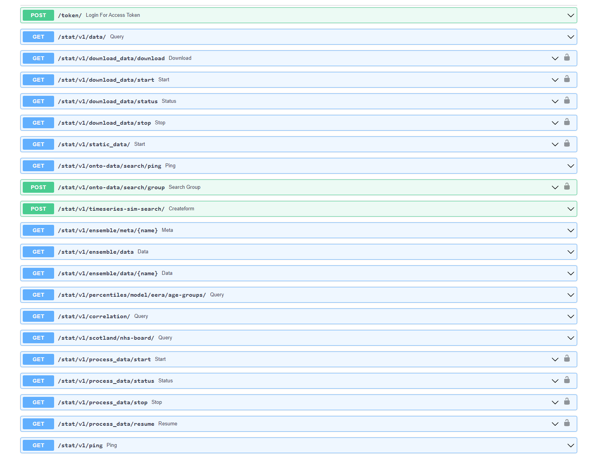

# About

APIs for data, processing functions, algorithms and propagation. 

## Getting Started

### Prerequisites

- Python 3.8.12
- MongoDB, Elasticsearch [see](../README.md)

### Start Development Instance

Conda environment

```bash
 conda env create --file environment.yaml
```

Pip environement
```bash
pip install virtualenv
virtualenv venv

# Linux/MAC
source ./venv/bin/activate
# Windows-11
.\venv\Scripts\activate

# install dependencies
pip install -r requirements.txt
```

Start the server in host machine:

```bash
uvicorn app.main:app --reload --port 4010 --host 0.0.0.0
```


## API Documentation

The API documentation and testing endpoints are automatically generated in a web page. The documentation interface can be accessed via: http://localhost:4010/docs. The screenshot of the API document page:



