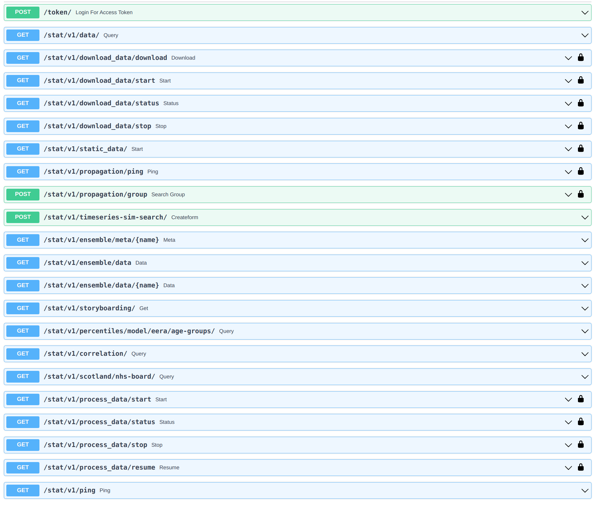

# About

APIs for data, processing functions, algorithms and propagation.

## Getting Started

### Prerequisites

- Python 3.8.12
- MongoDB, Elasticsearch [see](../README.md)

### Start Development Instance Locally

Update the external services URL in `data-api/app/config/default.json`, e.g.,

```bash
"url": "mongodb://localhost:27017/?directConnection=true",
"host": "http://localhost:9200",
```

Create Python environment and install dependencies.

```bash
pip install virtualenv
virtualenv venv
source ./venv/bin/activate

pip install -r requirements.txt
```

Start the server in host machine.

```bash
uvicorn app.main:app --reload --port 4010 --host 0.0.0.0
```

## API Documentation

The API documentation and testing endpoints are automatically generated in a web page. The documentation interface can be accessed via: http://localhost:4010/docs. The screenshot of the API document page:


