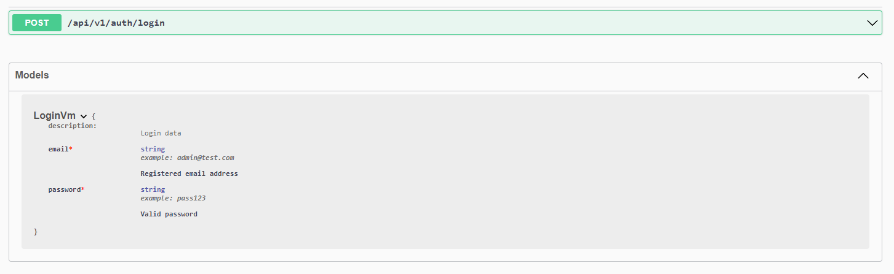

# About

Infrastructure APIs: authentication, user management, ontology operations, data service, etc.

## Getting Started

### Prerequisites

- Node version 16.13.0
- MongoDB, Elasticsearch [see](../README.md)

### Start Development Instance

```bash
# install dependencies
yarn install

# in Linux/MAC
yarn dev
# in Windows
yarn dev-win
```

## API Documentation

The API documentation and testing endpoints are automatically generated in a web page. The documentation interface can be accessed via: http://localhost:4000/api-docs/swagger.
The screenshot of the API document page:


The documentation work is ongoing and we will complete it soon.

# Thumbnail and Index Services

## Thumbnail Generator

This service generates thumbnail of the pages registered (propagated) to the ontology.

```bash
# in Linux/MAC
npx ts-node ./thumbnail-generator/main.ts --url "http://localhost:3000/page?id=" --target "file" --el "#charts"

# in Windows
npx ts-node .\thumbnail-generator\main.ts --url "http://localhost:3000/page?id=" --target "file" --el "#charts"
```

## Search Indexer

This service index the ontology data into a search engine.

```bash
# in Linux
./search-indexer/linux-amd64/monstache -f ./search-indexer/monstache.dev.toml
# in MAC
./search-indexer/darwin-amd64/monstache -f ./search-indexer/monstache.dev.toml
# in Windows
.\search-indexer\windows-amd64\monstache.exe -f .\search-indexer\monstache.dev.toml
```
